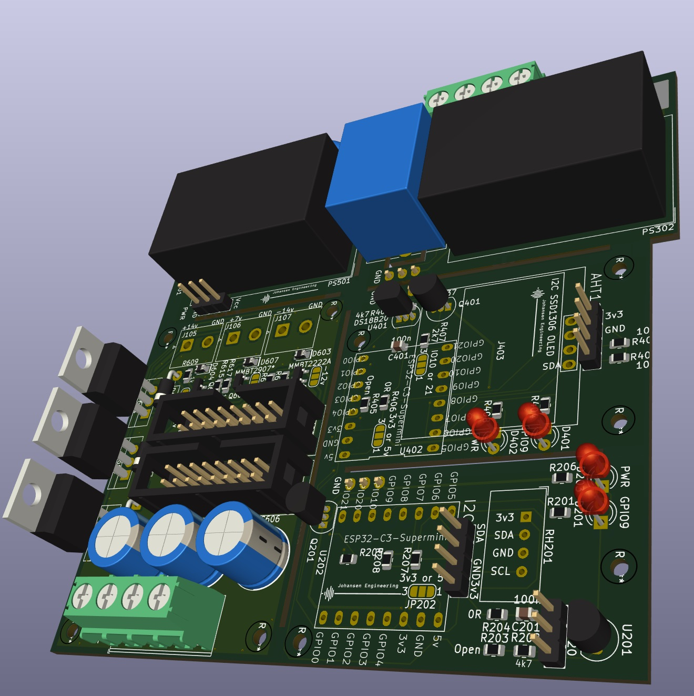

# HomeAutomationESP32C2mini_2024_2

 Kicad 8

# Purpose
Use for 

# Status - Preliminary mounted
## Initial 
| Stage  | Detail | Status |
| ------------- | ------------- | ------------- |
| create material  | sch/pcb | OK  |
| | gerber | OK |
| production  |   | in progress |
|  | produced |  |
|  | delivered |  |
## Preliminary validation
| Test  | Detail | Status |
| ------------- | ------------- | ------------- |
| Initial Inspection | |  |
| Initial Technical Test |  |  |
| Initial Technical Test |  |  |
| Initial Technical Test |  |  |
| Initial Product Test |  |  |
| Initial Product Test |  |  |
| Initial Product Test |  |  |
| Power Draw |  |  |
| Power Draw |  |  |
| Power Draw |  |  |

## Secondary validation
| Test  | Detail | Status |
| ------------- | ------------- |------------- |
| Product Test |  | |
| Product Test |  |  |
| Quality | | |
| Quality | | |
| Long Term Product Test |  |  |
| Power Draw |  |  |
| Power Draw |  |  |
| Power Draw |  |  |

## Errata
### Errata - Sub 1
### Errata - Sub 2
### Errata - Sub 3

## Issues and Notes
### Sub 1
### Sub 2

# Pictures

# Inspiration
