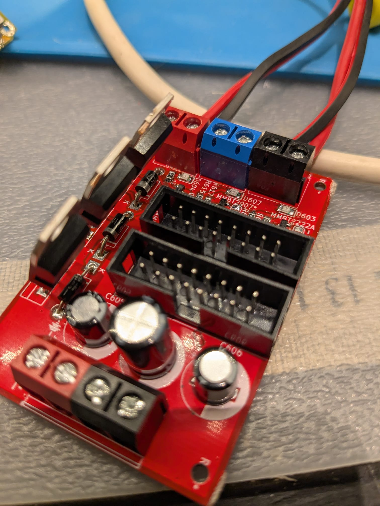
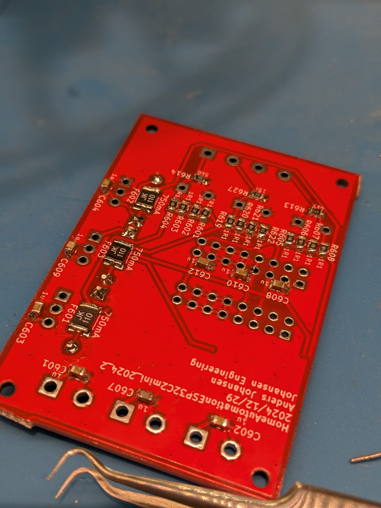
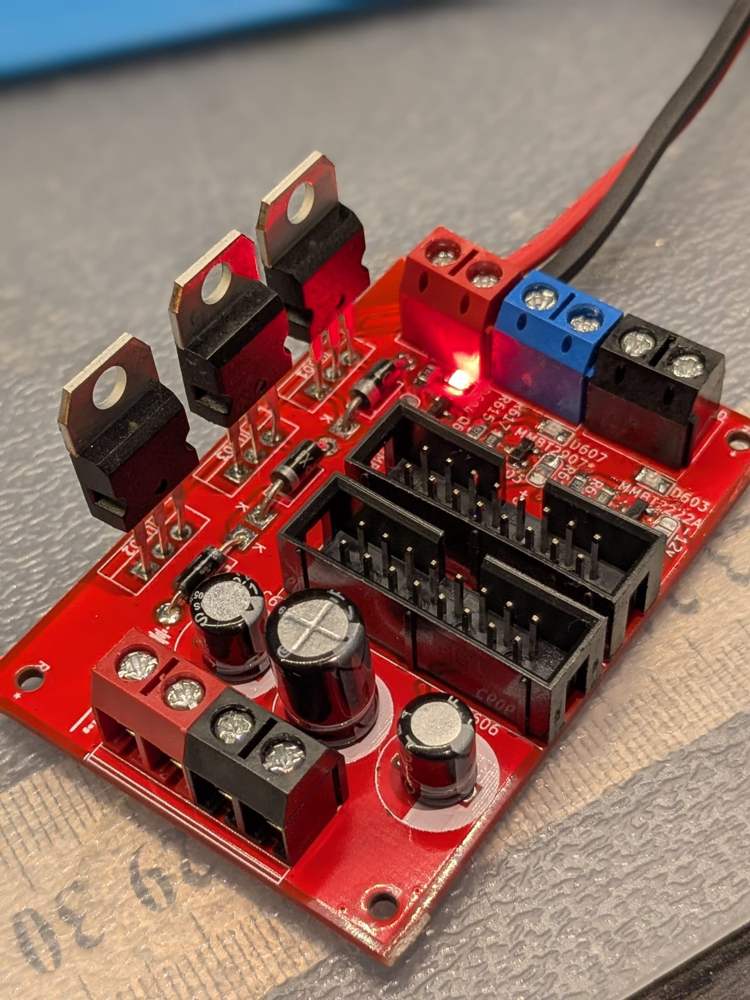

# HomeAutomationESP32C2mini_2024_2

 Kicad 8

# Purpose
Use for build into berker euro dåser

Two PSU modules and two uP modules

Additional power supply for +-12v and 5v for euro rack synth

## PSU
### 1 - Relay and 230V to 5v
### 2 - LED and 230V to 5v
## uP
### 1 - AM2320 and DS18B20
| ESP Designation  | Pin | Use |
| ------------- | ------------- | ------------- |
| U202 ESP32 C3 | GPIO05 | One Wire 18B20 |
| U202 ESP32 C3 | GPIO06 | SDA AM2320 / HDR |
| U202 ESP32 C3 | GPIO07 | SCL AM2320 / HDR |
| U202 ESP32 C3 | GPIO09 | LED |
| U202 ESP32 C3 | GPIO10 | Relay |
| U202 ESP32 C3 | GPIO21 | Relay Alternative |

### 2 - SSD1306 and AHT10
| ESP Designation  | Pin | Use |
| ------------- | ------------- | ------------- |
| U402 ESP32 C3 | GPIO05 | One Wire 18B20 |
| U402 ESP32 C3 | GPIO06 | SDA SSD1306 / AHT10 |
| U402 ESP32 C3 | GPIO07 | SCL SSD1306 / AHT10 |
| U402 ESP32 C3 | GPIO09 | LED |
| U402 ESP32 C3 | GPIO10 | Relay |
| U402 ESP32 C3 | GPIO21 | Relay Alternative |

## PSU for Euro rack - !!!!! EURORACK HEADER FLIPPED !!!!!!
+/-14v and 7v input

2x 16pin Eurorack power connectors as well as a +/-12v,5v,GND connector

Linear regulators 7805,7812,7912

Fuse blown detection with LED indication

# Status - Preliminary mounted
## Initial 
| Stage  | Detail | Status |
| ------------- | ------------- | ------------- |
| create material  | sch/pcb | OK  |
| | gerber | OK |
| production  |   | OK |
|  | produced | OK |
|  | delivered | OK? |
## Preliminary validation
| Test  | Detail | Status |
| ------------- | ------------- | ------------- |
| Initial Inspection | PWR RLY | OK |
| Initial Inspection | PWR |  |
| Initial Inspection | ESP32C3 OLED| RELAY not working |
|  | | OLED 0,96" not pin-compatible |
| Initial Inspection | ESP32C3 |  |
| Initial Technical Test | PWR RLY+ESP32C3 OLED AHT10 | OK - Blue LED req 820R - 10K pullup removed as impl in ESP32 pullup |
| Initial Technical Test |  |  |
| Initial Technical Test |  |  |
| Initial Product Test | PWR RLY+ESP32C3 OLED AHT10 | OK |
| Initial Product Test |  |  |
| Initial Product Test |  |  |
| Power Draw |  |  |
| Power Draw |  |  |
| Power Draw |  |  |

## Secondary validation
| Test  | Detail | Status |
| ------------- | ------------- |------------- |
| Product Test |  | |
| Product Test |  |  |
| Quality | | |
| Quality | | |
| Long Term Product Test |  |  |
| Power Draw |  |  |
| Power Draw |  |  |
| Power Draw |  |  |

## Errata
### Errata - Sub 1
### Errata - Sub 2
### Errata - Eurorack PSU - !!!!! EURORACK HEADER FLIPPED !!!!!!
| ERROR  | Detail | Workaround |
| ------------- | ------------- |------------- |
| J601 and J602 flipped | -12v on PIN 15+16 - should have been PIN 1+2 | FLIP the header compared to the silkscreen |

## Issues and Notes
### Sub 1
### Sub 2

# Pictures

# Inspiration
https://github.com/pforrmi/KiCad-SSD1306-128x64/tree/master
